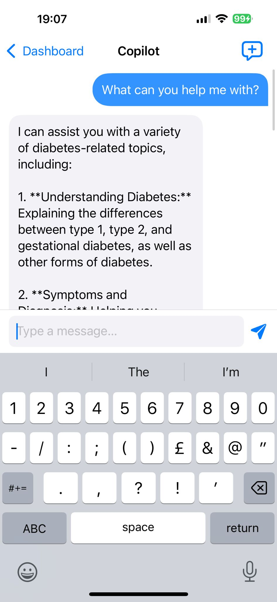

# type2DProj - Type 2 Diabetes Generative AI Co-Pilot (4)

type2DProj is an iOS application designed to help users manage and analyze continuous glucose monitoring (CGM) data, log meals, generate AI-based predictions, and receive personalized advice.

## Table of Contents
- [Features](#features)
- [Architecture](#architecture)
- [Dependencies](#dependencies)
- [Installation & Setup](#installation--setup)
- [File Structure](#file-structure)
- [Usage](#usage)
- [Bluetooth & CGM Flow](#bluetooth--cgm-flow)
- [Firestore Data Model](#firestore-data-model)
- [AI & Prediction](#ai--prediction)
- [Advice Engine](#advice-engine)
- [Screenshots](#screenshots)

## Features
- **Onboarding & Profile Setup**: Collect age, sex, clinical history, dietary preferences  
- **CGM Pairing**: BLE scan & pair Dexcom CGM devices with persistent auto-reconnect  
- **Live CGM Chart**: Real-time plotting via SwiftUI Charts with time filters  
- **Meal Logging**: Track carbs, protein, fat with daily nutrition summary  
- **AI Prediction**: TFLite GluNet model predicts glucose 30 min ahead  
- **Personal Advice**: Short-term alerts and long-term insights  
- **Analysis Dashboard**: Glucose stats, meal impacts, nutrition breakdown  

## Architecture
The app follows the MVVM pattern:
1. **Views** use SwiftUI and bind to `@StateObject` view models.  
2. **Services** handle core logic:  
   - `CGMService`: Bluetooth management with CGMBLEKit and Firestore writes  
   - `HealthKitService`: HealthKit data ingestion  
   - `AIService`: Chatbot API integration  
3. **ViewModels** manage data fetching and business logic.  
4. **Models** define shared data structures (e.g., `Reading`, `MealEntry`).  

## Dependencies
- **Carthage**: CGMBLEKit, LoopKit, Dexcom Share Client  
- **CocoaPods**: TensorFlowLiteSwift, Firebase SDK (Auth, Firestore)  
- **Swift Packages**: SwiftUI Charts  
- System frameworks: CoreBluetooth, HealthKit, Combine, SwiftUI  

## Installation & Setup
```bash
# 1. Clone repository
git clone https://github.com/your-org/type2DProj.git
cd type2DProj

# 2. Carthage frameworks
carthage bootstrap --platform iOS --use-xcframeworks

# 3. CocoaPods
gem install cocoapods
pod install

# 4. Open workspace
open type2DProj.xcworkspace

# 5. Add GoogleService-Info.plist to the app target.

# 6. Enable Bluetooth and HealthKit entitlements.

# 7. Build and run on a device or simulator.
```

## File Structure

```bash
cgm-backend-main       # Glucose AI Prediction Model and Copilot Code
type2DProj/
├─ App/                # App entry, SessionStore, App lifecycle
├─ Services/           # CGMService, AIService, AuthService
├─ ViewModels/         # ProfileSetupVM, CGMReadingsVM, GluNetVM, AnalysisVM
├─ Views/              # SwiftUI views (Onboarding, CGMView, AdviceView…)
├─ Models/             # Shared data structs
├─ Resources/          # Assets, Info.plist, entitlements
└─ Scripts/            # CI, build helpers
```


## Usage

1. Sign up / Log in via FirebaseAuth

2. Complete Profile Setup, optionally Pair CGM

3. Explore Dashboard: live CGM chart, nutrition, tasks

4. Visit CGM tab for detailed readings and disconnect

5. Use Quick Actions: Log Meal, AI Prediction, Copilot

6. Check Analysis and Advice for deeper insights


## Bluetooth & CGM Flow

1. On launch or on demand, scan for BLE CGM peripherals.

2. Filter by name (Dexcom/CGM), then connect via CoreBluetooth.

3. TransmitterDelegate receives glucose packets and writes each as a Firestore document under users/{uid}/glucoseReadings.

4. Saved configuration under users/{uid}/cgmConfig/info enables auto-reconnect on app restart.

5. Disconnect removes config and stops BLE.


## Firestore Data Model

``` bash
users/{uid}/
├─ profileinfo/info       # user profile fields
├─ cgmConfig/info         # paired SN and peripheralID
├─ glucoseReadings/{id}   # { value: Double, timestamp: Timestamp }
└─ meals/{id}             # { carbs, protein, fat, date }
```

## AI & Prediction

- GluNetModel (.tflite): Input shape [1,16,4] = [glucose, carbs, insulin, time]

- Glucose normalized, time scaled 0–1 across 24 h.

- Inference runs via GluNetViewModel, supports background processing.


## Advice Engine


- Short-Term Advice: Fetch latest glucose + meals, send prompt to chatbot API for 2-sentence advice.

- Long-Term Advice: Static progress-based recommendations.

- Chatbot endpoint: POST https://cgm-backend-depr.onrender.com/chat


## Screenshots

### Onboarding & Profile

| Login | Register | Profile Setup | Profile (Edit) |
|:---:|:---:|:---:|:---:|
|  |  |  |  |

---

### Home & Navigation

| Home Dashboard | Copilot | Copilot (Chat) |
|:---:|:---:|:---:|
|  |  |  |

---

### CGM & Meal Logging

| Bluetooth CGM Data | Meal Log | Meal Library |
|:---:|:---:|:---:|
|  |  |  |

---

### Analysis & Advice

| Analysis | Analysis (Details) | Advice | Advice (Long-Term) |
|:---:|:---:|:---:|:---:|
|  |  |  |  |

---

*Explore the app’s features: from onboarding and CGM pairing to meal tracking, AI-powered advice, and in-depth analysis—all designed for a seamless diabetes management experience.*